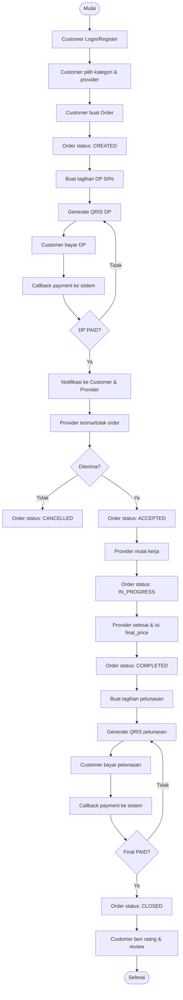

# Business Process – TukangDekat (Kecamatan Bojongloa Kaler)
Version 1.0  
Date: 2026-03-23

## 1. Tujuan
Mendefinisikan alur kerja utama (business process) pada sistem TukangDekat dari sisi Customer (pelanggan), Provider (tukang/teknisi), Admin (pengurus), dan Bendahara.

## 2. Aktor
1) Customer (Pelanggan/Warga)  
2) Provider (Tukang/Teknisi)  
3) Admin (Pengurus)  
4) Bendahara (Treasurer)

## 3. Alur Proses Utama (Narasi)
### 3.1 Registrasi & Login
1) Pengguna membuka aplikasi.
2) Pengguna melakukan registrasi atau login.
3) Sistem memberikan akses sesuai role pengguna.

### 3.2 Pencarian Provider & Pembuatan Order
1) Customer memilih kategori jasa (Listrik/Plumbing/AC/Bangunan Ringan/Servis Elektronik Rumah).
2) Sistem menampilkan daftar provider sesuai kategori.
3) Customer memilih provider dan mengisi form order (jadwal, alamat, catatan, foto opsional).
4) Sistem membuat order dengan status `CREATED`.
5) Sistem membuat tagihan DP sebesar 50% dari estimasi harga.

### 3.3 Pembayaran DP (QRIS)
1) Customer memilih bayar DP.
2) Sistem menampilkan QRIS untuk DP.
3) Customer melakukan pembayaran melalui aplikasi pembayaran (scan QRIS).
4) Payment gateway mengirim notifikasi hasil pembayaran ke sistem.
5) Sistem mengubah status pembayaran DP menjadi `PAID`.
6) Sistem mengirim notifikasi (WhatsApp/Email) ke Customer dan Provider bahwa DP sudah dibayar.

### 3.4 Provider Menerima Order & Mulai Pengerjaan
1) Provider menerima notifikasi order masuk.
2) Provider dapat menerima atau menolak order.
3) Jika menerima, status order menjadi `ACCEPTED`.
4) Provider hanya dapat memulai pengerjaan (status `IN_PROGRESS`) jika DP sudah `PAID`.
5) Provider mengerjakan jasa sesuai permintaan.

### 3.5 Penyelesaian Order & Pelunasan
1) Setelah pekerjaan selesai, Provider mengubah status order menjadi `COMPLETED` dan mengisi `final_price` (harga final).
2) Sistem membuat tagihan pelunasan sebesar (final_price - DP).
3) Sistem menampilkan QRIS pelunasan kepada Customer.
4) Customer membayar pelunasan.
5) Payment gateway mengirim notifikasi hasil pembayaran ke sistem.
6) Sistem mengubah status pembayaran pelunasan menjadi `PAID`.
7) Sistem mengubah status order menjadi `CLOSED`.

### 3.6 Rating & Review
1) Setelah order `CLOSED`, Customer dapat memberi rating dan review.
2) Sistem menyimpan rating dan menghitung rata-rata rating provider.

### 3.7 Monitoring Admin & Bendahara
1) Admin memverifikasi provider dan mengelola kategori jasa.
2) Bendahara memantau transaksi DP dan pelunasan serta ringkasan transaksi per periode.

## 4. Diagram Alur (Flowchart)

## 5. Catatan
- Kebijakan komisi platform dan refund DP akan ditetapkan pada fase implementasi (TBD).
- Diagram ini mencerminkan alur minimal untuk demo UTS/UAS.
