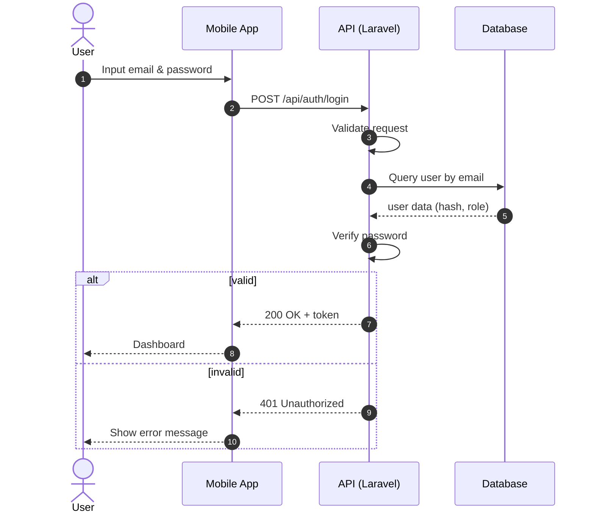
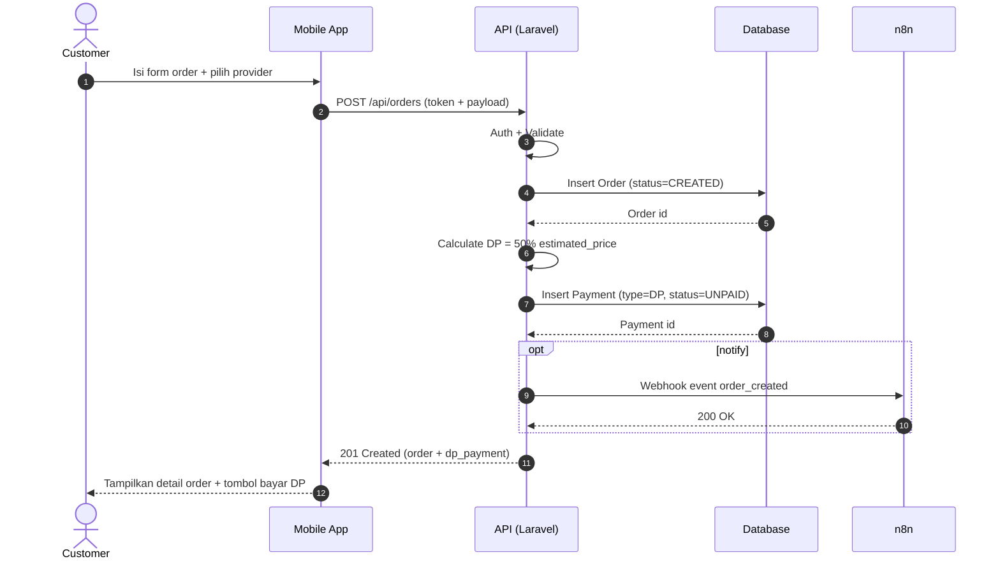
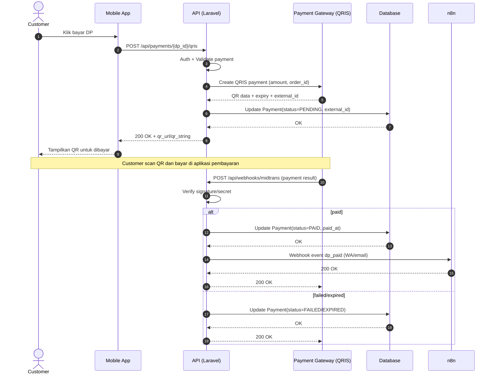
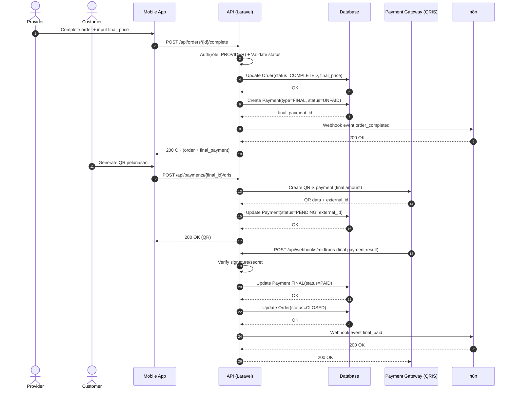

# Sequence Diagrams – TukangDekat
Version 1.0  
Date: 2026-03-23

Dokumen ini berisi sequence diagram untuk proses utama TukangDekat.
Diagram disediakan dalam:
1) Urutan langkah (mudah digambar di StarUML/draw.io)
2) Mermaid sequence diagram (langsung tampil di GitHub)

---

## SD-01 – Login
### A) Langkah-langkah (untuk StarUML)
Aktor/Objek:
- User (Mobile App)
- Mobile App
- API (Laravel)
- Database

Urutan:
1. User mengisi email dan password di Mobile App.
2. Mobile App mengirim request `POST /api/auth/login` ke API.
3. API memvalidasi input.
4. API mengambil data user berdasarkan email dari Database.
5. API memverifikasi password.
6. Jika valid, API membuat token akses.
7. API mengembalikan response sukses + token.
8. Mobile App menyimpan token dan menampilkan dashboard sesuai role.

Alur gagal:
- Jika email/password salah → API mengembalikan error (401) → Mobile App menampilkan pesan error.

### B) Mermaid

---

## SD-02 – Create Order + Create DP (50%) Invoice
### A) Langkah-langkah (untuk StarUML)
Aktor/Objek:
- Customer (Mobile App)
- Mobile App
- API (Laravel)
- Database
- n8n (untuk notifikasi order dibuat) [opsional event]

Urutan:
1. Customer memilih provider dan mengisi form order (jadwal, alamat, catatan, estimasi harga).
2. Mobile App mengirim request `POST /api/orders` ke API dengan token.
3. API memvalidasi token dan request body.
4. API menyimpan Order ke Database dengan status `CREATED`.
5. API menghitung DP = 50% dari `estimated_price`.
6. API menyimpan Payment DP ke Database dengan status `UNPAID`.
7. (Opsional) API mengirim event ke n8n: order_created.
8. API mengembalikan response berisi data order dan dp_payment.

Alur gagal:
- Jika token invalid → 401.
- Jika data tidak valid → 422.

### B) Mermaid

---

## SD-03 – Pay DP with QRIS + Payment Callback (Webhook) + Order Start Allowed
### A) Langkah-langkah (untuk StarUML)
Aktor/Objek:
- Customer (Mobile App)
- Mobile App
- API (Laravel)
- Payment Gateway (QRIS)
- Database
- n8n (notifikasi DP paid)

Urutan utama:
1. Customer klik “Bayar DP”.
2. Mobile App mengirim request `POST /api/payments/{dp_id}/qris` ke API.
3. API meminta pembuatan transaksi QRIS ke Payment Gateway (charge/create payment).
4. Payment Gateway mengembalikan data QR (qr_url/qr_string) + expiry.
5. API mengubah status payment menjadi `PENDING` (opsional) dan menyimpan external id.
6. API mengembalikan QR ke Mobile App.
7. Customer membayar dengan scan QR.
8. Payment Gateway mengirim callback ke endpoint webhook `POST /api/webhooks/midtrans`.
9. API memverifikasi signature/secret callback.
10. API mengubah status Payment DP menjadi `PAID` dan menyimpan waktu bayar.
11. API mengirim event ke n8n: dp_paid (notifikasi WA/email ke customer & provider).
12. Provider sekarang diperbolehkan memulai order (cek DP paid saat start).

Alur gagal:
- Callback tidak valid signature → tolak callback.
- Pembayaran gagal/expired → status payment `FAILED/EXPIRED` → customer diminta generate QR ulang.

### B) Mermaid

---

## SD-04 – Complete Order + Create Final Payment + Pay Final + Close Order
### A) Langkah-langkah (untuk StarUML)
Aktor/Objek:
- Provider (Mobile App)
- Customer (Mobile App)
- API (Laravel)
- Database
- Payment Gateway (QRIS)
- n8n

Urutan:
1. Provider mengubah order menjadi selesai dan mengirim `final_price` melalui `POST /api/orders/{id}/complete`.
2. API memvalidasi role provider dan status order.
3. API mengubah status order menjadi `COMPLETED` dan menyimpan `final_price`.
4. API menghitung `final_amount = final_price - dp_amount`.
5. API membuat Payment FINAL status `UNPAID`.
6. API mengirim event n8n: order_completed (minta customer bayar pelunasan).
7. Customer generate QRIS pelunasan `POST /api/payments/{final_id}/qris`.
8. Payment Gateway callback webhook pelunasan PAID.
9. API update Payment FINAL menjadi `PAID`.
10. API update status order menjadi `CLOSED`.
11. API mengirim event n8n: final_paid (order closed).

### B) Mermaid

